# 405 - Computer Architecture
Taught by [Prof. Ashutosh Srivastava](https://www.jnu.ac.in/content/asutosh)

### References
- [Computer System Architecture by M. Morris Mano](https://archive.org/details/computer-system-architecture-morris-mano-third-edition/page/n1/mode/2up)
- [Computer Architecture and Organization by IIT Kharagpur](https://drive.google.com/file/d/1jgy5Kb_jrPDCbVUCX7DDRWthQYRpI8lE/view)

### Prerequisites

- **Digital Logic**
    - Binary, Decimal, Octal and Hexadecimal Number Systems
    - Data Representation, Binary Arithmetic and Binary Codes 
    - Logic Gates, Boolean Algebra, Map Simplification
    - Combinational and Sequential Circuits

- **Assembly Language**
    - Arithmetic Operations (eg., ADD)
    - Logical Operations (eg., OR)
    - Branching Operations (eg., JUMP)
    - Data Transfer Operations (eg., MOV)
    - Machine Control Operations (eg., HLT)

- **Microprocessors**
    - Basic Organization and Design
    - Registers, Buses and Memory Units
    - Input/Output Unit and Peripherals
    - Register and Memory Transfer

---

### Basic Structure of a Computer
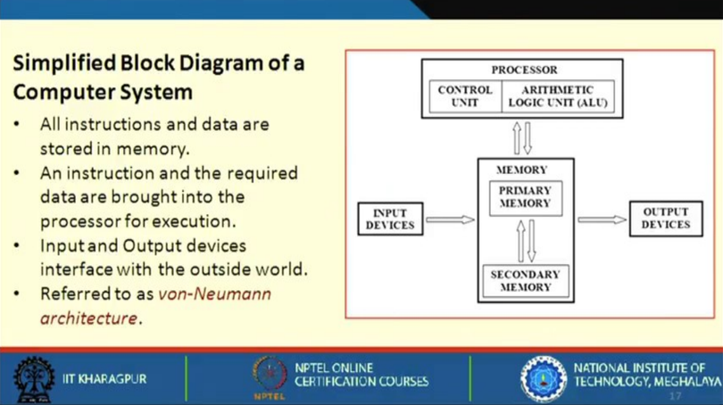
- CPU: ALU, Registers, Control Unit, Interrupts, I/O Unit
- Memory Unit
- I/O Unit
- Peripherals (DMA, Network Interface, etc.)
- Data Bus, Address Bus, Control Bus

### Computer Architecture vs. Computer Organization
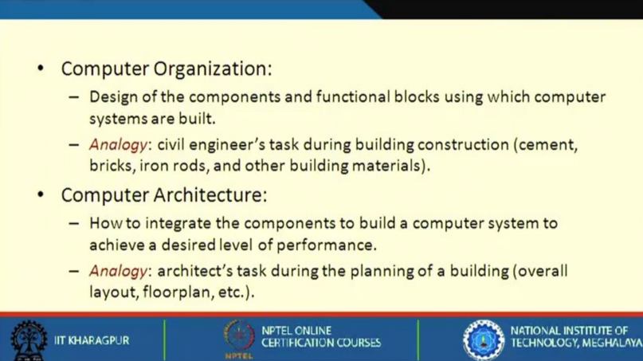

### History of Computer Processors
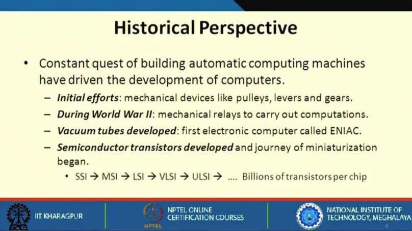

### Timeline for Operating Systems (Silicon-Based MOS Chips)
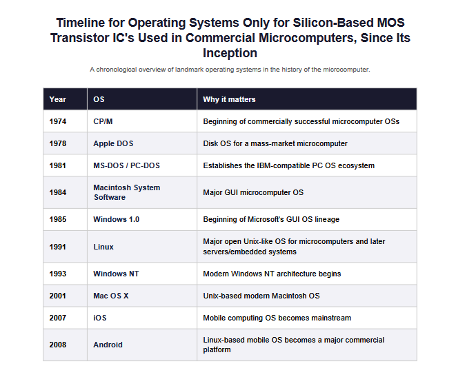

### 8085 Microprocessor

|**Key Specifications** ||
| :--- | :--- |
| **Data Bus Width** | 8-bit |
| **Address Bus Width** | 16-bit |
| **Memory Capacity** | 64 KB - (0000)H to (FFFF)H |
| **Clock Frequency** | 3 MHz |
| **Power Supply** | 5 Volts |
| **Packaging** | 40-pin DIP (NMOS) |
| **Instruction Set** | 74 instructions |

| **Register Set** ||
| :--- | :--- |
| **Accumulator - A (8)** | **Flags** |
| **B** (8) | **C** (8) |
| **D** (8) | **E** (8) |
| **H** (8) | **L** (8) |
| **Program Counter (PC) (16)** ||
| **Stack Pointer (SP) (16)** ||

- Accumulator stores operands and results for ALU operations.
- Flags can be Sign, Zero, Carry, Parity, etc.
- B, C, D, E, H, and L are general-purpose registers.
- HL register pair is used to store memory addresses and is referenced as `M`.

**Addressing Modes for the 8085 Microprocessor**
1. **Direct Addressing Mode:** The memory address of the data is explicitly provided in the instruction.
    - `LDA 2050H`
2. **Indirect Addressing Mode:** Memory address of data is stored inside the HL register pair.
    - `MOV A, M`
3. **Immediate Addressing Mode:** Data comes directly from I/O and is supplied within the instruction.
    - `MVI A, 05H`
4. **Register Transfer:** Data is moved directly between registers.
    - `MOV A, B`
5. **Implied Addressing Mode:** Operand is implied directly by the opcode (like complement of data, etc.)
    - `CMA`

### 8086 Microprocessor

|**Key Specifications** ||
| :--- | :--- |
| **Data Bus Width** | 16-bit |
| **Address Bus Width** | 20-bit |
| **Memory Capacity** | 1 MB - (00000)H to (FFFFF)H |
| **Clock Frequency** | 5 MHz |
| **Power Supply** | <= 5 Volts |
| **Packaging** | 40-pin DIP (scaled down) |
| **Instruction Set** | 117 instructions |

- In 8086, memory is segmented into code, data, stack, and extra segments.
- 8086 is bifurcated into:
    1. Bus-Interface Unit (BUI) - It is used to evaluate and identify the effective address (20-bit memory address)
    2. Execution Unit (EU)

| **Bus-Interface Unit** |
| :--- |
| Code Segment (CS) - 16 bit |
| Data Segment (DS) - 16 bit |
| Stack Segment (SS) - 16 bit |
| Extra Segment (ES) - 16 bit |
|Instruction Pointer (IP) - 16 bit |

| **Execution Unit** |
| :--- |
| AX (16) - Higher(8) + Lower(8) |
| BX (16) - Higher(8) + Lower(8) |
| CX (16) - Higher(8) + Lower(8) |
| DX (16) - Higher(8) + Lower(8) |
| Source Index (SI) - 16 bits |
| Destination Index (DI) - 16 bits |
| Base Pointer (BP) - 16 bits |
| Stack Pointer (SP) - 16 bits |

**Addressing Modes for the 8086 Microprocessor**
1. **Immediate Addressing Mode:** Data operand is a constant value directly supplied within the instruction.
    - `MOV AX, 0005H`
2. **Register Addressing Mode:** The data operand is stored inside an internal register.
    - `MOV AX, BX`
3. **Direct Addressing Mode:** The 16-bit offset memory address is directly specified inside the instruction.
    - `MOV AX, [2000H]`
4. **Register Indirect Addressing Mode:** The memory address is held inside a base (`BX`, `BP`) or index (`SI`, `DI`) register.
    - `MOV AX, [BX]`
5. **Based Addressing Mode:** Effective memory address is calculated by adding a displacement to a base register (`BX` or `BP`).
    - `MOV AX, [BX + 08H]`
6. **Indexed Addressing Mode:** Effective memory address is calculated by adding a displacement to an index register (`SI` or `DI`).
    - `MOV AX, [SI + 04H]`
7. **Based Indexed Addressing Mode:** Effective memory address is calculated by adding the contents of a base register and an index register.
    - `MOV AX, [BX + SI]`
8. **Based Indexed with Displacement Addressing Mode:** Effective memory address is calculated by adding a base register, an index register, and a displacement.
    - `MOV AX, [BX + SI + 08H]`
9. **Implied / Implicit Addressing Mode:** Operand is hidden or implicitly defined directly by the opcode itself.
    - `CLC`

### Harvard vs. von-Neumann Architecture
1. **Harvard Architecture:**
    - Developed at Harvard between 1937 and 1944.
    - Separate memory for program and data - Instructions are stored in program memory, and data are stored in data memory.
    - Instruction and data access can be done in parallel.
2. **von-Neumann Architecture:**
    - Developed in Princeton in 1945.
    - Instructions and data are stored in the same memory module.
    - More flexible and easier to implement.
    - Suitable for most general-purpose processors (including the 8085 and 8086).

### Instruction Set Architectures (ISA)
1. **Complex Instruction Set Computer (CISC) Architecture:**
    - Traditional Approach.
    - Large number of addressing modes (R-R, R-M, M-M, indexed, indirect, etc.).
    - Special-purpose registers and flags (sign, carry, zero, etc.).
    - Variable-length instructions / Complex instruction encoding.
    - Ease of mapping high-level language statements to machine instructions.
    - Instruction decoding/control unit design is more complex.
    - Pipeline implementation is quite complex.
    - Used in Intel x86, Intel Pentium and most Desktop PCs.
        - Each instructions requires multiple machine cycles.
        - Higher time taken for a single instruction (4T-7T).
    - Consumes more power.
2. **Reduced Instruction Set Computer (RISC) Architecture:**
    - Widely adopted today among many manufacturers.
    - Also known as **Load-Store Architecture**.
        - Only LOAD and STORE instruction access memory.
        - All other instruction operate on processor registers.
    - Simple architecture, designed for the sake of efficient pipelining.
    - Simple instruction set with very few addressing modes.
    - Large number of general-purpose registers. Very few special-purpose registers.
    - Instruction length and encoding are uniform for easy instruction decoding.
    - Compiler-assisted scheduling of the pipeline for improved performance.
    - Used in MIPS family, ARM, and smartphones.
    - Consumes less power.
    
### Instruction Cycle and Execution Time
- An instruction consists of three main stages:
    1. **Fetch:** CPU gets the next instruction from memory.
    2. **Decode:** Control unit interprets the binary instruction.
    3. **Execute:** CPU performs the required action.
- Most processors execute instructions in a synchronous manner using a clock that runs at a constant clock rate or **Frequency (f)**.
- The time taken to complete one single clock cycle is known as **Clock Cycle Time (C)**, given by **1/f**.
-  An instruction typically consists of multiple **Machine Cycles**.
- A machine cycle consists of multiple **T-states**, where a T-state is equal to one clock cycle.
- Thus, a single instruction may take multiple clock cycles to complete. This is known as **Cycles Per Instruction (CPI)**
- **Average CPI of a Program** is the average CPI of all instructions executed in a program (for a given processor).
- A program may contain multiple instruction to be executed. The total number of such instructions is known as the **Instruction Count (IC)**.
- The total **Execution Time (XT) = IC × CPI × C**

### Machine Cycles in 8085 Microprocessor
1. **Opcode Fetch Cycle (4T - 7T):** Finds the type of instruction to be executed.
2. **Memory Read Cycle (3T):** Reads an 8-bit data from a specified memory address.
3. **Memory Write Cycle (3T):** Writes an 8-bit data into a specified memory address.
4. **I/O Read Cycle (3T):** Reads an 8-bit data byte from an input port into the Accumulator.
5. **I/O Write Cycle (3T):** Sends an 8-bit data byte from the Accumulator to an output port.
6. **Interrupt Acknowledge Cycle:** Responds to an active interrupt request.
7. **Bus Idle / Halt Cycle:** Halting requires 1T state.

- Consider an Assembly Program that adds two 8-bit numbers stored at memory locations `2000H` and `2001H`, then stores the result at `2002H`.

| Instruction | Machine Cycles Breakdown | T-States |
| :--- | :--- | :--- |
| `LDA 2000H` | Opcode Fetch (4T) + Memory Read (3T) + Memory Read (3T) + Memory Read (3T) | 13T |
| `MOV B, A` | Opcode Fetch (4T) | 4T |
| `LDA 2001H` | Opcode Fetch (4T) + Memory Read (3T) + Memory Read (3T) + Memory Read (3T) | 13T |
| `ADD B` | Opcode Fetch (4T) | 4T |
| `STA 2002H` | Opcode Fetch (4T) + Memory Read (3T) + Memory Read (3T) + Memory Write (3T) | 13T |
| `HLT` | Opcode Fetch (4T) + Halt (1T) | 5T |

- **Total T-States:** = 13T + 4T + 13T + 4T + 13T + 5T = 52T
- **One T-State in 8085 (3MHz):** = 1/(3 * 10^6) = 0.33 μs
- **Total Execution Time:** = 52 * 0.33 = 17.33 μs

### Factors Affecting Performance
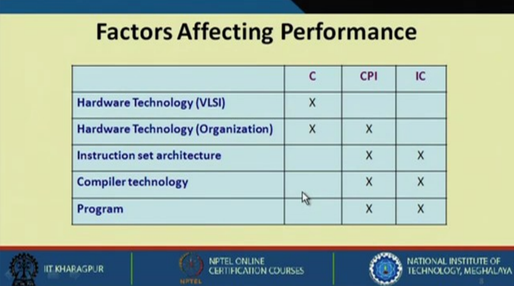
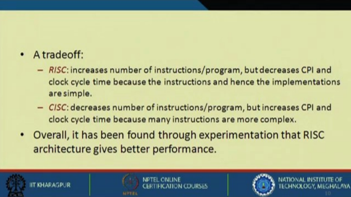

### Amdahl's Law
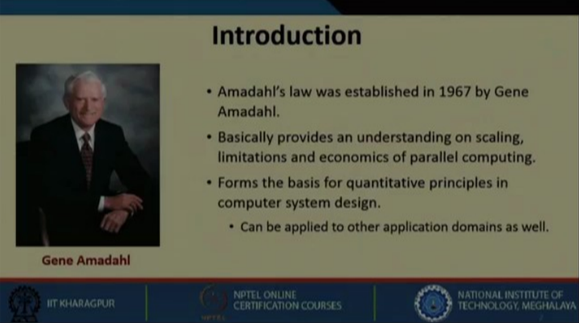
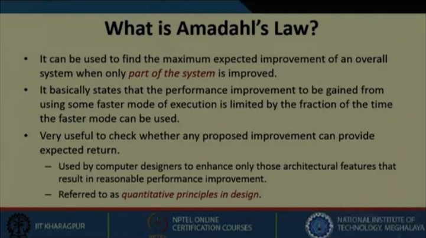
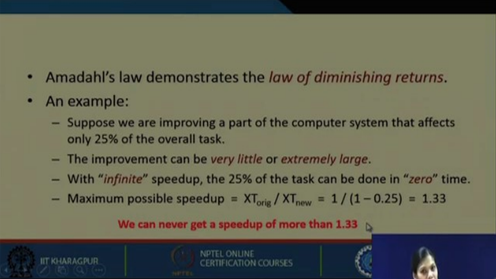
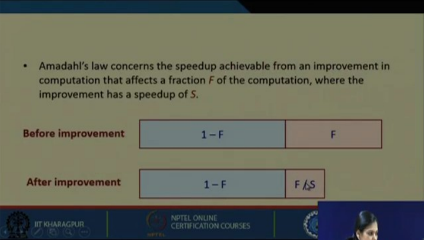
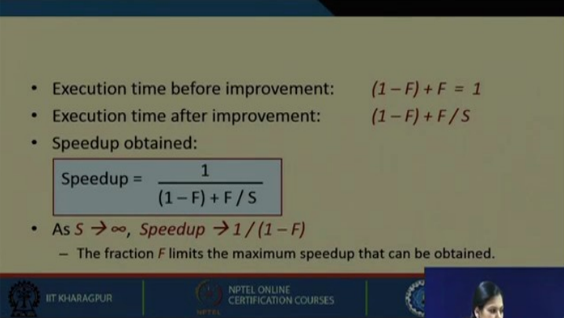
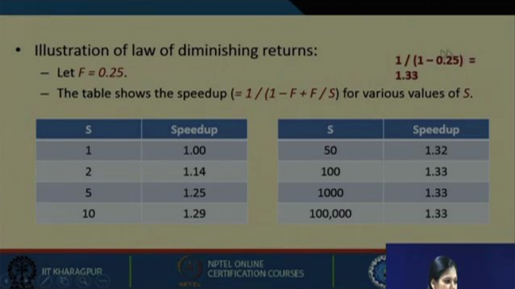
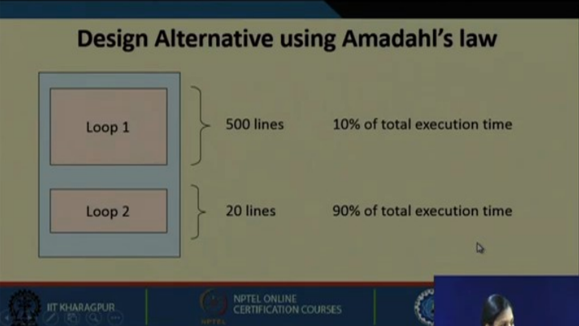
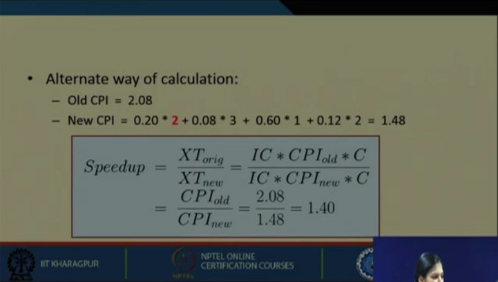

### Pipelining
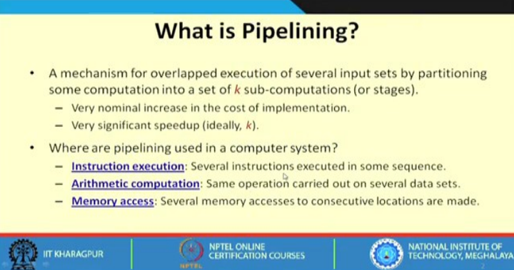
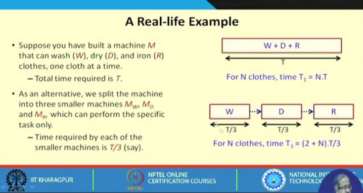
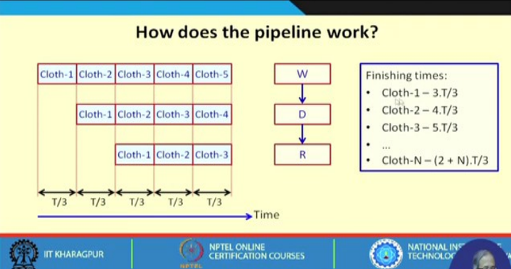
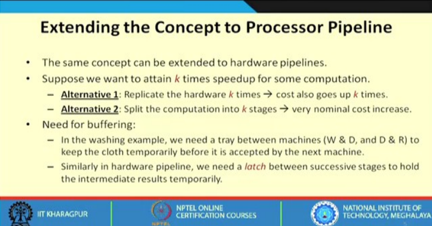

### Synchronous k-stage Pipeline
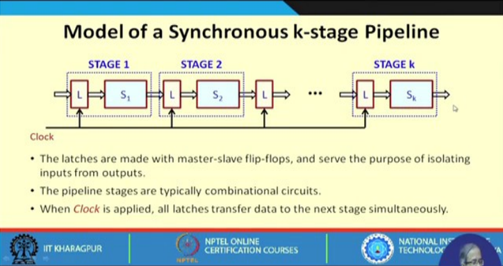

### Types of Pipelined Processors
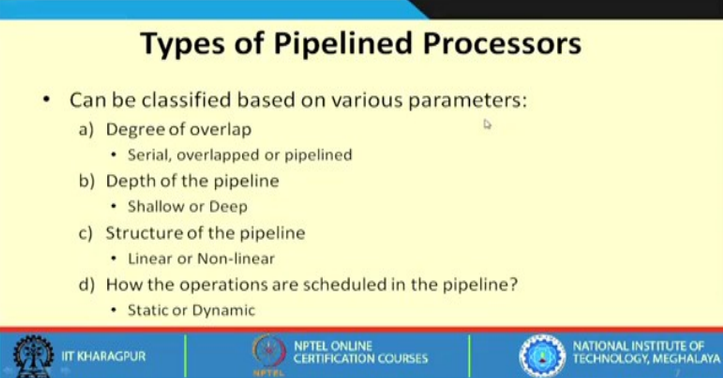
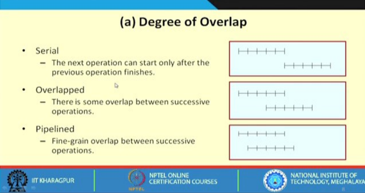
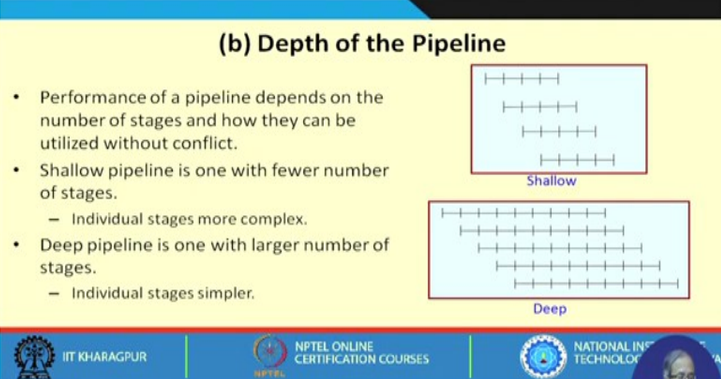
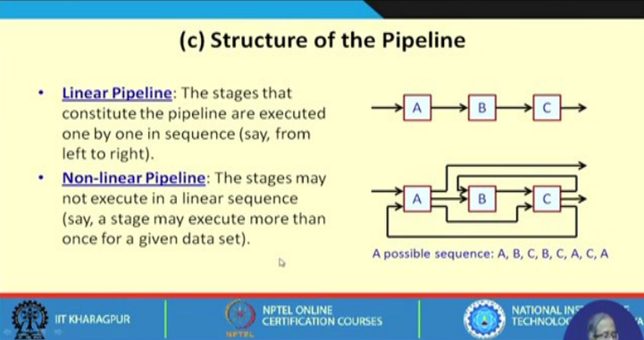
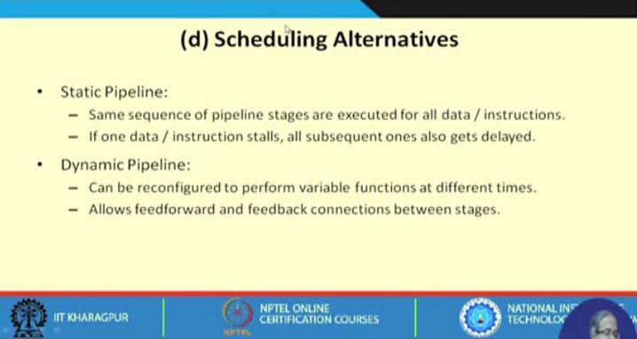

### Reservation Table
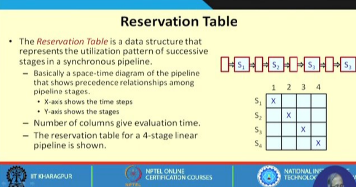
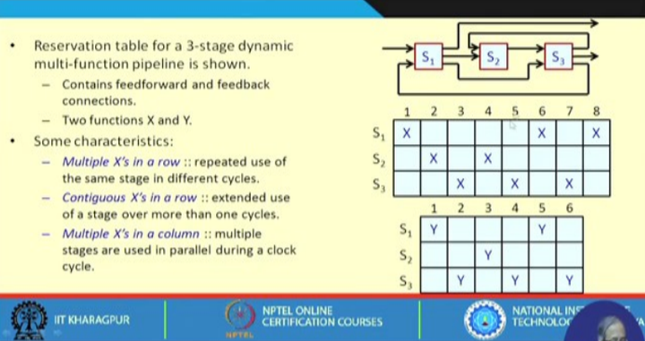

### Pipeline Speedup, Efficiency and Throughput
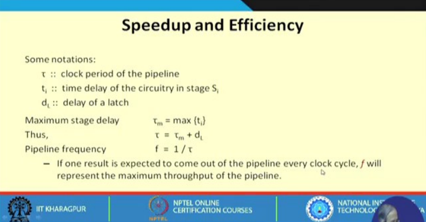
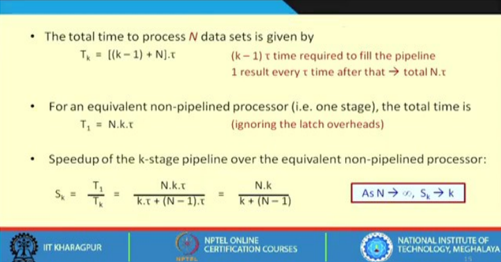
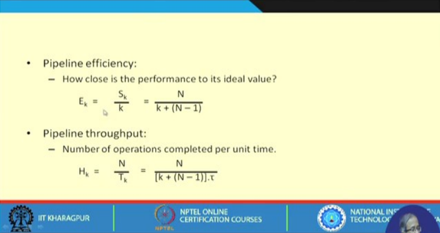