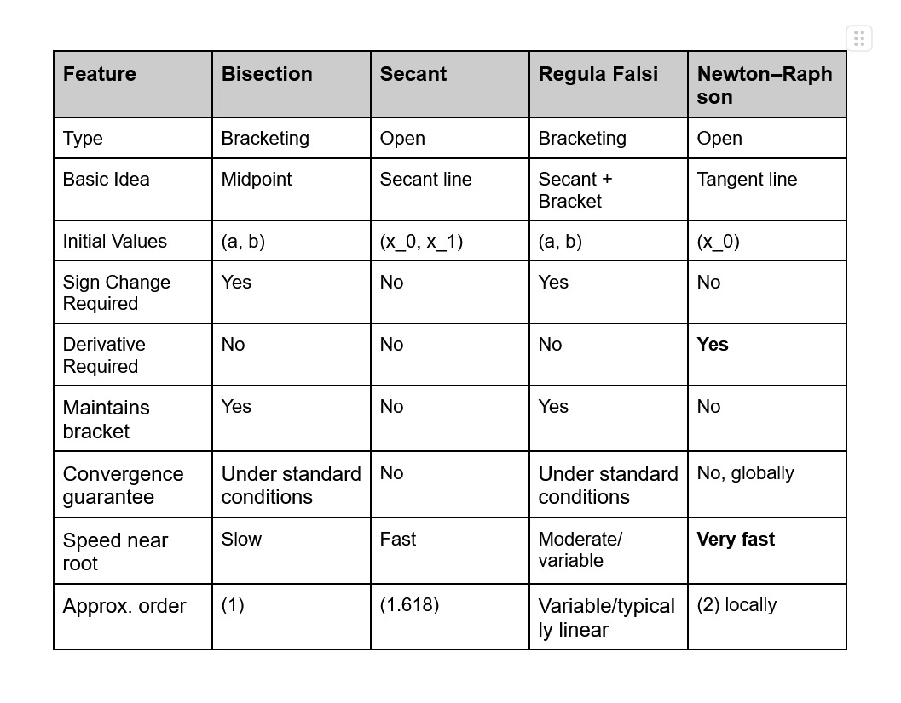
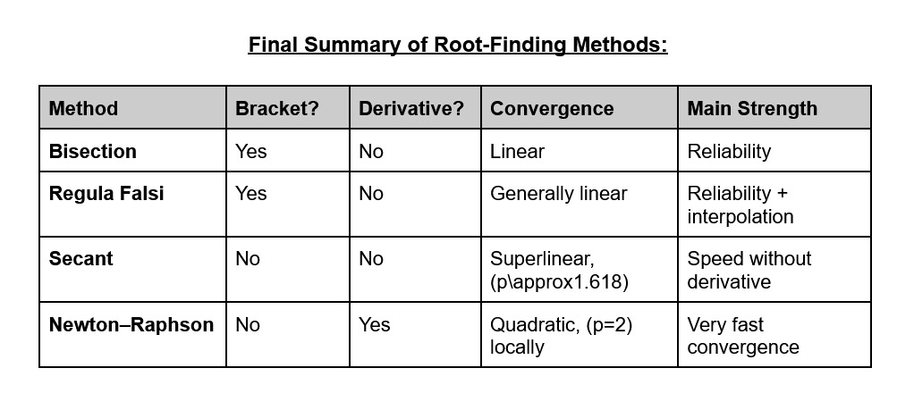

# CS 406: Numerical Methods

Taught by [Prof. Anuj Sachan](https://www.jnu.ac.in/content/anujsachan)

### References
- [Numerical Methods for Scientific and Engineering Computation by M. K. Jain, S. R. K. Iyengar, and R. K. Jain](https://archive.org/details/numericalmethods00jain_0)
- [Advanced Engineering Mathematics by Erwin Kreyszig](https://archive.org/details/advancedengineer0000krey_v5q8)
- [Numerical Methods for Engineers by Steven C. Chapra and Raymond P. Canale](https://archive.org/details/numericalmethods0000chap_q8b1)
- [Numerical Methods for Engineers Course by IIT Madras](https://nptel.ac.in/courses/127106019)
- [Numerical Methods Course by IIT Roorkee](https://drive.google.com/file/d/13vU8ZtrwjDmCOr-UY4g0DISWkARl3YeT/view)

 

> Numerical Methods is a branch of mathematics that designs, analyses and implements algorithms to obtain approximate numerical solutions to complex problems that cannot be solved exactly using analytical formulae.

---

## Finite Data Representation
Since computers have limited memory, it cannot store a number with infinite digits such as $\pi$ or $\frac{1}{3}$. This introduces the fundamental concept of **Finite Data Representation**.

### Fixed Point Numbers
- A method where a specific number of digits is permanently assigned to the integer part and a specific to the fractional part.
- The decimal part never moves.
- Examples:
    - $1234.6251 = 1234 + 0.6251$
    - $1234 = 1 \times 10^3 + 2 \times 10^2 + 3 \times 10^1 + 4 \times 10^0$
    - $0.6251 = 6 \times 10^{-1} + 2 \times 10^{-2} + 5 \times 10^{-3} + 1 \times 10^{-4}$

#### Decimal Number System
- Decimal Number System has **base 10** with digits $0, 1, 2, 3, 4, 5, 6, 7, 8, 9$.
- Any decimal number $N$ can be written as
    - $N = d_{n-1}d_{n-2}...d_{1}d_{0}.d{-1}{-2}...d_{-m}$
    - $(N)_{10} = d_{n-1} \times 10^{n-1} + ... + d_1 \times 10^{1} + d_{0} \times 10^{0} + d_{-1} \times 10^{-1} + ... + d_{-m} \times 10^{-m}$

#### Binary Number System
- Binary Number System has **base 2** with digits $0, 1$ called as **bits**.
- Any binary number $N$ can be written as
    - $N = b_{n-1}b_{n-2}...b_{1}b_{0}.b{-1}{-2}...b_{-m}$
    - $(N)_{2} = d_{n-1} \times 2^{n-1} + ... + d_1 \times 2^{1} + d_{0} \times 2^{0} + d_{-1} \times 2^{-1} + ... + d_{-m} \times 2^{-m}$
- Exercises:
    - Binary to Decimal conversion and vice versa.

#### Octal Number System
- Octal Number System has **base 8** with digits $0, 1, 2, 3, 4, 5, 6, 7$.
- Any octal number $N$ can be written as
    - $N = o_{n-1}o_{n-2}...o_{1}o_{0}.o{-1}{-2}...o_{-m}$
    - $(N)_{8} = d_{n-1} \times 8^{n-1} + ... + d_1 \times 8^{1} + d_{0} \times 8^{0} + d_{-1} \times 8^{-1} + ... + d_{-m} \times 8^{-m}$
- Exercises:
    - Octal to Decimal conversion and vice versa.
    - Octal to Binary conversion and vice versa.

#### Hexadecimal Number System
- Hexadecimal Number System has **base 16** with digits $0, 1, 2, 3, 4, 5, 6, 7, 8, 9, A, B, C, D, E, F$.
- Any hexadecimal number $N$ can be written as
    - $N = h_{n-1}h_{n-2}...h_{1}h_{0}.h{-1}{-2}...h_{-m}$
    - $(N)_{16} = d_{n-1} \times 16^{n-1} + ... + d_1 \times 16^{1} + d_{0} \times 16^{0} + d_{-1} \times 16^{-1} + ... + d_{-m} \times 16^{-m}$
- Exercises:
    - Hexadecimal to Decimal conversion and vice versa.
    - Hexadecimal to Binary conversion and vice versa.
    - Hexadecimal to Octal conversion and vice versa.

### Floating Point Numbers
- A method where the decimal part can float or move to adapt to the scale of the number.
- $x = \pm m \times b^e$, where $m$ is mantissa, $b$ is base, and $e$ is exponent.
- Example: $1234.56 = 1.23456 \times 10^3$
- Exercise: Subtract two floating point numbers $0.36143447 \times 10^7$ and $0.36132346 \times 10^7$
    - $0.36143447 \times 10^7 - 0.36132346 \times 10^7 = 0.00011101 \times 10^7$
- **Normalized floating point numbers** are numbers whose fractional part has been shifted to remove any redundant zeroes and save space
    - Example: $0.00011101 \times 10^7 \rightarrow 0.11101 \times 10^4$
- Exercise: Add two floating point numbers $0.123 \times 10^3$ and $0.456 \times 10^2$
    - $0.123 \times 10^3 \rightarrow 1.23 \times 10^2$
    - $0.123 \times 10^3 + 0.456 \times 10^2 = 1.686 \times 10^2$
    - $1.686 \times 10^2 \rightarrow 0.1686 \times 10^3$
    - $0.1686 \times 10^3 \approx 0.169 \times 10^3$ (by roundoff)
    - $0.1686 \times 10^3 \approx 0.168 \times 10^3$ (by chopping)

---

## Errors
- In numerical computation, the values used in a calculation are often approximated. 
- So, the error $e$ is $e = x - \overline{x}$, where $x$ is the **true value** and $\overline{x}$ is the **approximated value**.
- In terms of magnitude, $|e| = |x - \overline{x}|$
- The error which is machine dependent is called **machine epsilon**.

### Inherent Error
It is the quantity which is already present in the statement of the problem before its solution.

### The Round-off Error
It is the quantity $R$ which must be added to the finite representation of a computed number in order to make it the true representation of that number.

### The Truncation Error
It is the quantity $t$ that must be added to the true representation of the quantity in order for the result to be exactly equal to the quantity we are seeking to generate.

### The Propagation of Error
- Consider $y = f(x)$. If $x$ contains an error, then the calculated value of $y$ will also contain an error.
- The propagation of an error is the process by which errors present in input data or intermediate computations effect the accuracy of the final computed result.

#### Absolute Error
- Let $y = f(x)$ and $x$ contain a small error $dx$.
- From Taylor Expansion, $f(x + dx) \approx f(x) + f'(x).dx$
- We know, $dy = f(x + dx) - f(x)$
- So, $dy \approx f'(x).dx$
- Therefore, $|dy| = |f'(x)|.|dx|$
- Example: Let $y = x^2$, $x = 10$, and $x = 0.1$.
    - $dy = f'(x).dx$
    - $f'(x) = 2x$
    - $dy = (2 \times 10) \times 0.1$
    - $dy = 2$

#### Relative Error
- $|\frac{dy}{y}| = |\frac{x.f'(x)}{f(x)}|.|\frac{dx}{x}|$
- From the previous example:
    - $\frac{x.f'(x)}{f(x)} = \frac{x.2x}{x^2} = 2$
    - $\frac{dy}{y} = 2 \times \frac{dx}{x} = 2 \times \frac{0.1}{10}$
    - $\frac{dy}{y} = 0.02$
    - Approximately $2\%$ error in  $x^2$.

#### Propagation of Error in Several Variables
- Consider, $z = f(x, y)$
- $dz = \frac{\partial f}{\partial x}.dx + \frac{\partial f}{\partial y}.dy$
- The maximum possible absolute error can be computed as:
    - $|dz| \approx |\frac{\partial f}{\partial x}|.|dx| + |\frac{\partial f}{\partial y}|.|dy|$
- Generalization, $z = f(x_1, x_2, ... , x_n)$
    - $|dz| \approx \sum_{i=1}^{n} |\frac{\partial f}{\partial x_i}|.|dx_i|$

| Addition | Subtraction | Multiplication | Division |
| :--- | :--- | :--- | :--- |
| $z = x + y$ | $z = x - y$ | $z = x.y$ | $z = \frac{x}{y}$ |
| $dz = dx + dy$ | $dz = dx - dy$ |  $\frac{dz}{z} = \frac{dx}{x} + \frac{dy}{y}$ | $\frac{dz}{z} = \frac{dx}{x} - \frac{dy}{y}$ |
| Max absolute error: | Max absolute error: | Relative error: | Relative error: |
| $\vert dz \vert \le \vert dx \vert + \vert dy \vert$ | $\vert dz \vert \le \vert dx \vert + \vert dy \vert$ |  $\vert \frac{dz}{z} \vert \le \vert \frac{dx}{x} \vert + \vert \frac{dy}{y} \vert$ | $\vert \frac{dz}{z} \vert \le \vert \frac{dx}{x} \vert + \vert \frac{dy}{y} \vert$ |

#### Error Propagation Exercises

1. $y = x^3$, where $x = 2$, with error as $0.01$. Find approximate and relative error.
    - Given, $y = x^3$, $x = 2$, and $dx = 0.01$.
    - $f'(x) = 3x^2$
    - $|dy| = |f'(x)|.|dx| = 3x^2.dx$
    - $dy = 3 \times 2^2 \times 0.01$
    - **Approximate error:** $|dy| = 0.12$
    - $|\frac{dy}{y}| = |\frac{x.f'(x)}{f(x)}|.|\frac{dx}{x}|$
    - $\frac{x.f'(x)}{f(x)} = \frac{x.3x^2}{x^3}= 3$
    - $|\frac{dy}{y}| = 3 \times |\frac{dx}{x}| = 3 \times \frac{0.01}{2}$
    - **Relative error:** $|\frac{dy}{y}| = 0.015 = 1.5\%$

2. $z = x + y$, where $x = 10 \pm 0.1$ and $y = 20 \pm 0.2$. Find maximum error in $z$.
    - $|dz| \le |dx| + |dy|$
    - $|dz| \le 0.1 + 0.2$
    - **Maximum absolute error:** $|dz| \le 0.3$

3. $A = L.W$, where $L = 20 + 0.1$ cm and $W = 10 + 0.05$ cm. Find in A, the maximum error and relative error.
    - $dz = y.dx + x.dy$
    - $dz = 10(0.1) + 20(0.05)$
    - **Maximum error:** $dz = 2 cm^2$
    - $|\frac{dz}{z}| \le |\frac{dx}{x}| + |\frac{dy}{y}|$
    - $|\frac{dz}{z}| \le \frac{0.1}{20} + \frac{0.05}{10}$
    - **Relative error:** $|\frac{dz}{z}| = 0.01 = 1\%$

### Accuracy
It refers to how close an approximate value is to the true or exact value.

### Precision
It refers to the degree of consistency or fineness of the numerical representation or measurements.

> If measurements are close to one another, they are precise, but they are not necessarily accurate.

---

## Solutions of Non-linear Equations (Finding Roots)
- Non-linear equations are equations that can be generally written as $f(x) = 0$, where $f(x)$ is non-linear in $x$.
- Examples:
    - $x^2 - x = 0$
    - $x^3 - x- 1 = 0$
    - $e^x - x - 2 = 0$
    - $\sin(x - \frac{x}{2}) = 0$
- **Root:** A number $r$ is called a root or zero of $f(x)$ if $f(r) = 0$.
    - Example: $x^2 - 4 = 0$
    - For $x = 2$, $f(2) = 0$
    - For $x = -2$, $f(-2) = 0$
    - So, roots are $\pm 2$

### Geometrical Interpretation
- Let $y = f(x)$ and $f(x) = 0$. So, $y = 0$. Therefore, a root is the point where $y = f(x)$ intersects the x-axis.
- Consider $y = f(x) = x^3 - x - 1 = 0$
    - f(1) = 1 - 1 - 1 = -1
    - f(2) = 8 - 2 - 1 = 5
    - Function changes from negative to positive between $1$ and $2$.
    - So, we know a root exists somewhere in $1 \lt x \lt 2$
- **Root finding problem:** Given $f(x)$, find $x = r$ such that $f(r) = 0$.

### Types of Root Finding Methods

1. **Bracketing Method:** In this method, first we identify the interval $[a, b]$ such that a root is known to lie inside it.
    - Example: Bisection Method

2. **Open Methods:** These methods do not necessarily maintain interval containing the root.
    - Example: Newton-Raphson Method, Secant Method, Fixed Point Iteration.
    - They converge much faster but they may also fail if the initial approximation is not suitable.

### Initial Approximations
- Initial approximations to the root are often known from the physical consideration of the problem. Otherwise, graphical methods are generally used to obtain initial approximations to the root.
- Another commonly used method to obtain the initial approximation to the root is based on intermediate value theorem.
- **The Intermediate Value Theorem** states that if $f(x)$ is a continuous function on some interval $[a, b]$ and $f(a).f(b) \lt 0$, then the equation $f(x) = 0$ has at least one real root or an odd number of real roots in the interval $[a, b]$.
- Example 1: 
    - The equation $8x^3 - 12x^2 -2x + 3 = 0$ has three real roots. Find the intervals each of unit length containing each one of those roots.

| **x** | -2 | -1 | 0 | 1 | 2 | 3 |
| :-- | :-- | :-- | :-- | :-- | :-- | :-- |
| **f(x)** | -105 | 15 | 3 | -3 | 13 | 105 |

-   - From the above, we find that equation $f(x) = 0$ has roots in the intervals $(-1, 0)$, $(0, 1)$, and $(1, 2)$.
    - The exact roots are $-0.5$, $0.5$, and $1.5$.
- Example 2: 
    - Obtain intervals which contain the root of the equation $f(x) = \cos(x) - x.e^x$

| **x** | 0 | 0.5 | 1 | 1.5 | 2 |
| :-- | :-- | :-- | :-- | :-- | :-- |
| **f(x)** | 1 | 0.0532 | -2.1700 | -6.6518 | -13.1982 |

-   - The above equation has roots in the interval $(0.5, 1)$.
    - The exact root is $0.5177573637...$

---

## Bisection Method
This method is used on the repeated applications of the intermediate value theorem.

### Pseudocode
- Given $f(x)$, $a$, $b$:
- Check $f(a).f(b) \lt 0$
- Repeat $c = \frac{a + b}{2}$
- If $f(c) = 0$:
    - Return $c$
- If $f(a).f(c) \lt 0$:
    - $b = c$
- Else:
    - $a = c$
- Until stopping criteria is satisfied,
- Return $c$

### Exercises on Bisection Method

#### Exercise 1
Perform four iterations of the bisection method to find the approximate root of the equation $f(x) = x^3 - x - 1 = 0$.
- Initial intervals $a = 1$ and $b = 2$
- $f(1) = -1$, $f(2) = 5$
- $f(1).f(2) \lt 0$. 
- So, root lies in the interval $(1, 2)$.
- **Iteration 1:**
    - Midpoint, $c = \frac{1 + 2}{2} = 1.5$
    - $f(c) = f(1.5) = (1.5)^3 - (1.5) - 1 = 0.875$
    - $f(1).f(1.5) \lt 0$
    - So, root lies in the interval $(1, 1.5)$.
- **Iteration 2:**
    - Midpoint, $c = \frac{1 + 1.5}{2} = 1.25$
    - $f(c) = f(1.25) = (1.25)^3 - (1.25) - 1 = -0.296875$
    - $f(1.25).f(1.5) \lt 0$
    - So, root lies in the interval $(1.25, 1.5)$.
- **Iteration 3:**
    - Midpoint, $c = \frac{1.25 + 1.5}{2} = 1.375$
    - $f(c) = f(1.375) = (1.375)^3 - (1.375) - 1 = 0.22461$
    - $f(1.25).f(1.375) \lt 0$
    - So, root lies in the interval $(1.25, 1.375)$.
- **Iteration 4:**
    - Midpoint, $c = \frac{1.25 + 1.375}{2} = 1.3125$
    - $f(c) = f(1.3125) = (1.3125)^3 - (1.3125) - 1 = -0.0515$
    - $f(1.3125).f(1.375) \lt 0$
    - So, root lies in the interval $(1.3125, 1.375)$.
- Approximate value of the root, $r \approx \frac{1.3125 + 1.375}{2} = 1.34375$

#### Exercise 2
Perform five iterations of the bisection method to obtain the smallest possible positive root of the equation $f(x) = x^3 - 5x + 1 = 0$.
- Initial intervals $a = 0$ and $b = 1$
- $f(0) = (0)^3 - 5(0) + 1 = 1$
- $f(1) = (1)^3 - 5(1) + 1 = -3$
- $f(0).f(1) < 0$.
- So, root lies in the interval $(0, 1)$.
- **Iteration 1:**
    - Midpoint, $c = \frac{0 + 1}{2} = 0.5$
    - $f(c) = f(0.5) = (0.5)^3 - 5(0.5) + 1 = -1.375$
    - $f(0).f(0.5) < 0$
    - So, root lies in the interval $(0, 0.5)$.
- **Iteration 2:**
    - Midpoint, $c = \frac{0 + 0.5}{2} = 0.25$
    - $f(c) = f(0.25) = (0.25)^3 - 5(0.25) + 1 = -0.234375$
    - $f(0).f(0.25) < 0$
    - So, root lies in the interval $(0, 0.25)$.
- **Iteration 3:**
    - Midpoint, $c = \frac{0 + 0.25}{2} = 0.125$
    - $f(c) = f(0.125) = (0.125)^3 - 5(0.125) + 1 = 0.376953$
    - $f(0.125).f(0.25) < 0$
    - So, root lies in the interval $(0.125, 0.25)$.
- **Iteration 4:**
    - Midpoint, $c = \frac{0.125 + 0.25}{2} = 0.1875$
    - $f(c) = f(0.1875) = (0.1875)^3 - 5(0.1875) + 1 = 0.069092$
    - $f(0.1875).f(0.25) < 0$
    - So, root lies in the interval $(0.1875, 0.25)$.
- **Iteration 5:**
    - Midpoint, $c = \frac{0.1875 + 0.25}{2} = 0.21875$
    - $f(c) = f(0.21875) = (0.21875)^3 - 5(0.21875) + 1 = -0.083282$
    - $f(0.1875).f(0.21875) < 0$
    - So, root lies in the interval $(0.1875, 0.21875)$.
- Approximate value of the root, $r \approx \frac{0.1875 + 0.21875}{2} = 0.203125$

#### Exercise 3
Perform five iterations of the bisection method to find the approximate root of the equation $f(x) = \cos(x) - x.e^x = 0$.

- Initial interval $a = 0$ and $b = 1$
- $f(0) = \cos(0) - (0)e^0 = 1$
- $f(1) = \cos(1) - (1)e^1 = 0.540302 - 2.718282 = -2.177980$
- $f(0).f(1) < 0$.
- So, root lies in the interval $(0, 1)$.
- **Iteration 1:**
    - Midpoint, $c = \frac{0 + 1}{2} = 0.5$
    - $f(c) = f(0.5) = \cos(0.5) - (0.5)e^{0.5} = 0.877583 - 0.824361 = 0.053222$
    - $f(0.5).f(1) < 0$
    - So, root lies in the interval $(0.5, 1)$.
- **Iteration 2:**
    - Midpoint, $c = \frac{0.5 + 1}{2} = 0.75$
    - $f(c) = f(0.75) = \cos(0.75) - (0.75)e^{0.75} = 0.731689 - 1.587750 = -0.856061$
    - $f(0.5).f(0.75) < 0$
    - So, root lies in the interval $(0.5, 0.75)$.
- **Iteration 3:**
    - Midpoint, $c = \frac{0.5 + 0.75}{2} = 0.625$
    - $f(c) = f(0.625) = \cos(0.625) - (0.625)e^{0.625} = 0.810963 - 1.167654 = -0.356691$
    - $f(0.5).f(0.625) < 0$
    - So, root lies in the interval $(0.5, 0.625)$.
- **Iteration 4:**
    - Midpoint, $c = \frac{0.5 + 0.625}{2} = 0.5625$
    - $f(c) = f(0.5625) = \cos(0.5625) - (0.5625)e^{0.5625} = 0.845924 - 0.987218 = -0.141294$
    - $f(0.5).f(0.5625) < 0$
    - So, root lies in the interval $(0.5, 0.5625)$.
- **Iteration 5:**
    - Midpoint, $c = \frac{0.5 + 0.5625}{2} = 0.53125$
    - $f(c) = f(0.53125) = \cos(0.53125) - (0.53125)e^{0.53125} = 0.862176 - 0.903686 = -0.041510$
    - $f(0.5).f(0.53125) < 0$
    - So, root lies in the interval $(0.5, 0.53125)$.
- Approximate value of the root, $r \approx \frac{0.5 + 0.53125}{2} = 0.515625$

### Error Bound for Bisection Method
- How accurate is the Bisection Method?
- For the initial interval $(a, b)$, the interval length is $b - a$. 
- After one iteration, the interval length becomes $\frac{b - a}{2}$.
- After two iterations, it is $\frac{b - a}{2^2}$.
- After $n$ iterations, it is $\frac{b - a}{2^n}$.
- This gives us the direct error bound.
- Since the root lies inside any $(\pm , \pm)$ interval, the maximum distance between the midpoint and the root is half the interval length.
- Therefore, after $n$ iterations, $|x_n - r| \le \frac{b - a}{2^{n+1}}$, where $x_n$ is the approximate root and $r$ is the actual root.

#### Finding the Error Bound
- Let $a = 1$ and $b = 2$. Find the error bound after five iterations.
- $|x_n - r| \le \frac{b - a}{2^{n+1}}$
- $|x_n - r| \le \frac{2 - 1}{2^{6}}$
- $|x_n - r| \le \frac{1}{64}$
- $|x_n - r| \le 0.015625$

#### Number of Iterations Required
- Let us assume that we want an error bound, $|x_n - r| \le \epsilon$.
- So, we require $\frac{b - a}{2^{n+1}} \le \epsilon$.
- $2^{n+1} \ge \frac{b - a}{\epsilon}$
- $n + 1 \ge \frac{\log(\frac{b - a}{\epsilon})}{\log(2)}$
- So, $n \ge \frac{\log(\frac{b - a}{\epsilon})}{\log(2)} - 1$.

### Priori Error in Bisection Method
- **Priori Error** is an error estimate defined before or independently of the actual approximation.
- For bisection method, $|x_n - r| \le \frac{b - a}{2^{n+1}}$

### Posteriori Error in Bisection Method
- **Posteriori Error** is an estimate based on the current numerical results.
- For bisection method, if the current interval is $(a_n, b_n)$, then $|x_n - r| \le \frac{b_n - a_n}{2}$.
- This tells us how accurate our current approximation is.

### Convergence of Bisection Method
- Bisection is a convergent method under standard assumptions that:
    1. $f(x)$ is a continuous function between the interval $(a, b)$.
    2. $f(a).f(b) \lt 0$.
- Therefore, $\lim_{n \to \infty} (b_n - a_n) = 0$
- Bisection method has guaranteed convergence under the continuity and sign change conditions.

---

## Secant Method
- If $f(x)$ is a first degree equation in $x$, then it can be readily solved. The iteration method which will produce the exact results whenever function of $f(x) = 0$ is a first degree equation is given by:
    - $f(x) = a_0x + a_1 = 0$
    - $x = -\frac{a_1}{a_0}$
- If $x_{k - 1}$ and $x_k$ are two approximations to the root, then we determine $a_0$ and $a_1$ by using the following equations:
    - $f_{k - 1} = a_0x_{k - 1} + a_1$
    - $f_{k} = a_0x_{k} + a_1$
    - Where, $f_{k - 1} = f(x_{k - 1})$ and $f_k = f(x_k)$.
    - $\therefore a_0 = \frac{f_k - f_{k - 1}}{x_k - x_{k - 1}}$ and $a_1 = \frac{x_k.f_{k - 1} - x_{k - 1}.f_k}{x_k - x_{k - 1}}$
- The two approximations are:
    - $x_{k - 1} \to f(x_{k - 1})$
    - $x_{k} \to f(x_{k})$
- Now, instead of taking the midpoint, draw a straight line using the following two points $(x_{k - 1}, f(x_{k - 1}))$ and $(x_k, f(x_k))$.
- The point where this line intersects the x-axis is taken as the next approximation.

### Derivation of the Secant Formula:
- The slope between the two points $(x_{k - 1}, f(x_{k - 1}))$ and $(x_k, f(x_k))$ is given by $m = \frac{f(x_k) - f(x_{k - 1})}{x_k - x_{k - 1}}$.
- The equation of the line through $(x_k, f(x_k))$ is given by $y - f(x_k) = m(x - x_k)$.
- $y - f(x_k) = \frac{f(x_k) - f(x_{k - 1})}{x_k - x_{k - 1}}(x - x_k)$
- At the root of the secant line, $y = 0$.
- $\therefore - f(x_k) = \frac{f(x_k) - f(x_{k - 1})}{x_k - x_{k - 1}}(x - x_k)$
- $x - x_k = \frac{-f(x_k)(x_k - x_{k - 1})}{f(x_k) - f(x_{k - 1})}$
- $x_{k + 1} = x_k - \frac{(x_k - x_{k - 1})}{f(x_k) - f(x_{k - 1})}.f(x_k)$

### Advantages of the Secant Method
- Does not require derivative $f'(x)$.
- Usually much faster than bisection method.
- Uses function values more intelligently than bisection method.
- Easy to implement.

### Limitations of the Secant Method
- Convergence is not guaranteed for arbitrary initial guesses.
- The approximation can move away from the root.
- It may encounter division by a vert small quantity if $f(x_k) - f(x_{k - 1})$ is approximately zero.

> If the approximations are such that $f_k.f_{k-1} \lt 0$, then the other method is known as **Regular Falsi Method**.

### Exercises on Secant and Regular Falsi Methods
The real root of the equation $f(x) = x^3 - 5x + 1 = 0$ lies in the interval $(0, 1)$. Perform four iterations of the Secant Method and the Regular Falsi Method to obtain the root.

#### Using Secant Method
- Let $x_0 = 0$ and $x_1 = 1$.
- $f(x_0) = f(0) = 1$
- $f(x_1) = f(1) = -3$
- **Iteration 1:** 
    - $x_2 = x_1 - \frac{(x_1 - x_0)}{f(x_1) - f(x_0)}.f(x_1)$
    - $x_2 = 1 - \frac{(1 - 0)}{-3 - 1}(-3)$
    - $x_2 = x_1 - \frac{(x_1 - x_0)}{f(x_1) - f(x_0)}.f(x_1)$
    - $x_2 = 1 - \frac{(1 - 0)}{-3 - 1}(-3)$
    - $x_2 = 1 - 0.75 = 0.25$
    - $f(x_2) = f(0.25) = (0.25)^3 - 5(0.25) + 1 = -0.234375$
- **Iteration 2:**
    - $x_3 = x_2 - \frac{(x_2 - x_1)}{f(x_2) - f(x_1)}.f(x_2)$
    - $x_3 = 0.25 - \frac{(0.25 - 1)}{-0.234375 - (-3)}(-0.234375)$
    - $x_3 = 0.25 - 0.063560 = 0.186440$
    - $f(x_3) = f(0.186440) = (0.186440)^3 - 5(0.186440) + 1 = 0.074281$
- **Iteration 3:**
    - $x_4 = x_3 - \frac{(x_3 - x_2)}{f(x_3) - f(x_2)}.f(x_3)$
    - $x_4 = 0.186440 - \frac{(0.186440 - 0.25)}{0.074281 - (-0.234375)}(0.074281)$
    - $x_4 = 0.186440 + 0.015296 = 0.201736$
    - $f(x_4) = f(0.201736) = (0.201736)^3 - 5(0.201736) + 1 = -0.000470$
- **Iteration 4:**
    - $x_5 = x_4 - \frac{(x_4 - x_3)}{f(x_4) - f(x_3)}.f(x_4)$
    - $x_5 = 0.201736 - \frac{(0.201736 - 0.186440)}{-0.000470 - 0.074281}(-0.000470)$
    - $x_5 = 0.201736 - 0.000096 = 0.201640$
- Approximate value of the root, $r \approx 0.201640$

#### Using Regula Falsi Method
- Let $x_0 = 0$ and $x_1 = 1$.
- $f(x_0) = 1$, $f(x_1) = -3$
- $f(x_0).f(x_1) < 0$.
- So, root lies in the interval $(0, 1)$.
- **Iteration 1:**
    - $x_2 = x_1 - \frac{(x_1 - x_0)}{f(x_1) - f(x_0)}.f(x_1)$
    - $x_2 = 1 - \frac{(1 - 0)}{-3 - 1}(-3) = 0.25$
    - $f(x_2) = f(0.25) = -0.234375$
    - $f(x_0).f(x_2) < 0$
    - So, root lies in the interval $(0, 0.25)$.
- **Iteration 2:**
    - $x_3 = x_2 - \frac{(x_2 - x_0)}{f(x_2) - f(x_0)}.f(x_2)$
    - $x_3 = 0.25 - \frac{(0.25 - 0)}{-0.234375 - 1}(-0.234375)$
    - $x_3 = 0.25 - 0.047468 = 0.202532$
    - $f(x_3) = f(0.202532) = -0.004352$
    - $f(x_0).f(x_3) < 0$
    - So, root lies in the interval $(0, 0.202532)$.
- **Iteration 3:**
    - $x_4 = x_3 - \frac{(x_3 - x_0)}{f(x_3) - f(x_0)}.f(x_3)$
    - $x_4 = 0.202532 - \frac{(0.202532 - 0)}{-0.004352 - 1}(-0.004352)$
    - $x_4 = 0.202532 - 0.000877 = 0.201655$
    - $f(x_4) = f(0.201655) = -0.000074$
    - $f(x_0).f(x_4) < 0$
    - So, root lies in the interval $(0, 0.201655)$.
- **Iteration 4:**
    - $x_5 = x_4 - \frac{(x_4 - x_0)}{f(x_4) - f(x_0)}.f(x_4)$
    - $x_5 = 0.201655 - \frac{(0.201655 - 0)}{-0.000074 - 1}(-0.000074)$
    - $x_5 = 0.201655 - 0.000015 = 0.201640$.
- Approximate value of the root, $r \approx 0.201640$

---

## Newton-Raphson Method
Instead of using a second line secant through the two points, Newton-Raphson uses the tangent line at the current point to estimate where the function crosses the x-axis.
- Let us consider a current approximation $x_k$.
- Instead of considering the entire curve, i.e., $y = f(x)$, we draw its tangent line.
- The point on the curve is $(x_k, f(x_k))$.
- The slope of the tangent at this point is given by, $f'(x_k)$.
- So, the equation of the tangent line is given by, $y - f(x_k) = f'(x_k).(x - x_k)$.
- At the root of the tangent line, $y = 0$.
- $\therefore -f(x_k) = f'(x_k).(x - x_k)$
- $x_{k + 1} = x_k - \frac{f(x_k)}{f'(x_k)}$, where $x_k$ is the initial approximation and $x_{k + 1}$ is the new approximation.

### Convergence of Newton-Raphson Method
- Newton-Raphson is a fast method, but it is not globally guaranteed to converge for initial guesses.
- Its excellent convergence behaviour is mainly a local property near a suitable root.
- A poor initial sum can cause the method to diverge, oscillate, move towards another root, or maybe encounter a point where the derivative of $f$, $f'(x) = 0$ make very large jumps.

### Advantages of Newton-Raphson Method
- Very fast near the root.
- Usually requires fewer iterations.
- Simple iteration formula.
- Does not require bracketing intervals like bisection or regular falsi methods.
- Useful for many non-linear problems.

### Limitations of Newton-Raphson Method
- Derivative is required.
- Poor initial guess can cause failure.
- Derivative can become zero or very small.
- Multiple roots can reduce the usual conversions rates.

### Exercises on Newton-Raphson Method

#### Exercise 1
Let $f(x) = x^3 - x - 1 = 0$. Assume an initial approximation of $x_0 = 1.5$. Perform four iterations using Newton-Raphson Method.
- $f'(x) = 3x^2 - 1$
- Initial approximation, $x_0 = 1.5$
- **Iteration 1:**
    - $f(x_0) = f(1.5) = (1.5)^3 - 1.5 - 1 = 0.875$
    - $f'(x_0) = f'(1.5) = 3(1.5)^2 - 1 = 5.75$
    - $x_1 = x_0 - \frac{f(x_0)}{f'(x_0)} = 1.5 - \frac{0.875}{5.75}$
    - $x_1 = 1.347826$
- **Iteration 2:**
    - $f(x_1) = f(1.347826) = (1.347826)^3 - 1.347826 - 1 = 0.100361$
    - $f'(x_1) = f'(1.347826) = 3(1.347826)^2 - 1 = 4.449896$
    - $x_2 = x_1 - \frac{f(x_1)}{f'(x_1)} = 1.347826 - \frac{0.100361}{4.449896}$
    - $x_2 = 1.325271$
- **Iteration 3:**
    - $f(x_2) = f(1.325271) = (1.325271)^3 - 1.325271 - 1 = 0.002536$
    - $f'(x_2) = f'(1.325271) = 3(1.325271)^2 - 1 = 4.269023$
    - $x_3 = x_2 - \frac{f(x_2)}{f'(x_2)} = 1.325271 - \frac{0.002536}{4.269023}$
    - $x_3 = 1.324677$
- **Iteration 4:**
    - $f(x_3) = f(1.324677) = (1.324677)^3 - 1.324677 - 1 = -0.000178$
    - $f'(x_3) = f'(1.324677) = 3(1.324677)^2 - 1 = 4.264301$
    - $x_4 = x_3 - \frac{f(x_3)}{f'(x_3)} = 1.324677 - \frac{-0.000178}{4.264301}$
    - $x_4 = 1.324719$
- Approximate value of the root, $r \approx 1.324719$

#### Exercise 2
Let $f(x) = x^3 - 5x + 1 = 0$. Assume an initial approximation of $x_0 = 0.5$. Perform four iterations using Newton-Raphson Method.
- $f'(x) = 3x^2 - 5$
- Initial approximation, $x_0 = 0.5$
- **Iteration 1:**
    - $f(x_0) = f(0.5) = (0.5)^3 - 5(0.5) + 1 = -1.375$
    - $f'(x_0) = f'(0.5) = 3(0.5)^2 - 5 = -4.25$
    - $x_1 = x_0 - \frac{f(x_0)}{f'(x_0)} = 0.5 - \frac{-1.375}{-4.25}$
    - $x_1 = 0.176471$
- **Iteration 2:**
    - $f(x_1) = f(0.176471) = (0.176471)^3 - 5(0.176471) + 1 = 0.123143$
    - $f'(x_1) = f'(0.176471) = 3(0.176471)^2 - 5 = -4.906574$
    - $x_2 = x_1 - \frac{f(x_1)}{f'(x_1)} = 0.176471 - \frac{0.123143}{-4.906574}$
    - $x_2 = 0.201567$
- **Iteration 3:**
    - $f(x_2) = f(0.201567) = (0.201567)^3 - 5(0.201567) + 1 = 0.000357$
    - $f'(x_2) = f'(0.201567) = 3(0.201567)^2 - 5 = -4.878113$
    - $x_3 = x_2 - \frac{f(x_2)}{f'(x_2)} = 0.201567 - \frac{0.000357}{-4.878113}$
    - $x_3 = 0.201640$
- **Iteration 4:**
    - $f(x_3) = f(0.201640) = (0.201640)^3 - 5(0.201640) + 1 = -0.000002$
    - $f'(x_3) = f'(0.201640) = 3(0.201640)^2 - 5 = -4.878023$
    - $x_4 = x_3 - \frac{f(x_3)}{f'(x_3)} = 0.201640 - \frac{-0.000002}{-4.878023}$
    - $x_4 = 0.201640$
- Approximate value of the root, $r \approx 0.201640$

#### Exercise 3
Approximate the value of $(17)^{\frac{1}{3}}$. Assume an initial approximation of $x_0 = 2$. Perform four iterations using Newton-Raphson Method.
- Let $(17)^{1/3} = x$. So, $f(x) = x^3 - 17 = 0$.
- $f'(x) = 3x^2$
- Initial approximation, $x_0 = 2$
- **Iteration 1:**
    - $f(x_0) = f(2) = (2)^3 - 17 = -9$
    - $f'(x_0) = f'(2) = 3(2)^2 = 12$
    - $x_1 = x_0 - \frac{f(x_0)}{f'(x_0)} = 2 - \frac{-9}{12}$
    - $x_1 = 2.75$
- **Iteration 2:**
    - $f(x_1) = f(2.75) = (2.75)^3 - 17 = 3.796875$
    - $f'(x_1) = f'(2.75) = 3(2.75)^2 = 22.6875$
    - $x_2 = x_1 - \frac{f(x_1)}{f'(x_1)} = 2.75 - \frac{3.796875}{22.6875}$
    - $x_2 = 2.582645$
- **Iteration 3:**
    - $f(x_2) = f(2.582645) = (2.582645)^3 - 17 = 0.226380$
    - $f'(x_2) = f'(2.582645) = 3(2.582645)^2 = 20.010159$
    - $x_3 = x_2 - \frac{f(x_2)}{f'(x_2)} = 2.582645 - \frac{0.226380}{20.010159}$
    - $x_3 = 2.571332$
- **Iteration 4:**
    - $f(x_3) = f(2.571332) = (2.571332)^3 - 17 = 0.000997$
    - $f'(x_3) = f'(2.571332) = 3(2.571332)^2 = 19.835241$
    - $x_4 = x_3 - \frac{f(x_3)}{f'(x_3)} = 2.571332 - \frac{0.000997}{19.835241}$
    - $x_4 = 2.571282$
- Approximate value of $(17)^{1/3} \approx 2.571282$

---

## Summary of Root-Finding Methods

---

## Muller's Method
Instead of fitting a straight line, it fits a quadratic, polynomial through three points.

- Lets consider a function $f(x) = a_0x^2 + a_1x + a_2 = 0$, which is a polynomial of degree two.
- $a_0$, $a_1$, and $a_2$ are three arbitrary parameters to be determined by prescribing three approximate conditions $f(x)$ and/or its derivates.
- If $x_{k - 2}$, $x_{k - 1}$, and $x_k$ are three approximations to the root of $f(x) = 0$, then we may determine $a_0$, $a_1$, and $a_2$ by using the condition as:
    - $f_{k-2} = a_0x_{k-2}^{2} + a_1x_{k-2} + a_2$
    - $f_{k-1} = a_0x_{k-1}^{2} + a_1x_{k-1} + a_2$
    - $f_{k} = a_0x_{k}^{2} + a_1x_{k} + a_2$

- Determining $a_0$, $a_1$, and $a_2$ from the equation,
$$\begin{vmatrix} f(x) & x^2 & x & 1 \\ f_{k-2} & x^2_{k-2} & x_{k-2} & 1 \\ f_{k-1} & x^2_{k-1} & x_{k-1} & 1 \\ f_{k} & x^2_{k} & x_{k} & 1 \end{vmatrix}$$

- $f(x) = \frac{(x - x_{k-1})(x - x_k)}{(x_{k-2} - x_{k-1})(x_{k-2} - x_k)}.f_{k-2} + \frac{(x - x_{k-2})(x - x_k)}{(x_{k-1} - x_{k-2})(x_{k-1} - x_k)}.f_{k-1} + \frac{(x - x_{k-2})(x - x_{k-1})}{(x_{k} - x_{k-2})(x_{k} - x_{k-1})}.f_{k} = 0$

- When, $h = x - x_k$, $h_k = x_k - x_{k-1}$, and $h_{k-1} = x_{k-1} - x_{k-2}$,
- $\frac{h(h + h_k)}{h_{k-1}(h_{k-1} + h_k)}.f_{k-2} - \frac{h(h + h_k + h_{k-1})}{h_k.h_{k-1}}.f_{k-1} + \frac{(h + h_k)(h + h_k + h_{k-1})}{h_k(h_k + h_{k-1})}.f_k = 0$

- $\lambda = \frac{h}{h_k}$, $\lambda_{k} = \frac{h_k}{h_{k-1}}$, and $\partial_{k} = 1 + \lambda_{k}$
- $C_k\lambda^{2} + g_k\lambda + \partial_{k} f_k = 0$,
- Where, $g_k = \lambda^2_{k}f_{k-2} - \partial^2_{k}f_{k-1} + (\lambda_{k} + \partial_{k})f_k$
- And, $C_k = \lambda_{k}(\lambda_{k}f_{k-2} - \partial_k f_{k-1} + f_k)$

- $\lambda = \frac{-g_k \pm \sqrt{g_k^2 - 4\partial_k f_k C_k}}{2C_k}$
- Or, $\lambda = \frac{-2\partial_k f_k}{g_k \pm \sqrt{g^2_{k} - 4\partial_k f_k C_k}}$
- Choosing the sign in the denominator to maximize magnitude.
    - If $g_2 < 0 \implies \text{minus sign}$
    - If $g_2 > 0 \implies \text{plus sign}$

- $\lambda_{k+1} = \frac{h}{h_k} = \frac{x - x_k}{x_k - x_{k-1}}$
- $x_{k+1} = x_k + (x_k - x_{k-1})\lambda_{k+1}$
- Or, $x_{k+1} = x_k + h_k\lambda_{k+1}$

#### Exercise 1
Perform three iterations of the Muller's Method to find the smallest positive root of the equation $f(x) = x^3 - 5x + 1 = 0$
- The smallest root lies in the interval $(0, 1)$.
- Let $x_0 = 0$, $x_1 = 0.5$, and $x_2 = 1$.
- So, $f_0​ = 1$, $f_1​ = −1.375$, and $f_2 ​= −3$.
- **Iteration 1:**
    - $h_1 = x_1 - x_0 = 0.5$, $h_2 = x_2 - x_1 = 0.5$
    - $\lambda_2 = \frac{h_2}{h_1} = \frac{0.5}{0.5} = 1$
    - $\partial_2 = 1 + \lambda_2 = 1 + 1 = 2$
    - $g_2 = 1^2(1) - 2^2(-1.375) + (1 + 2)(-3) = -2.5$
    - $C_2 = 1(1(1) - 2(-1.375) + (-3)) = 0.75$
    - Since, $g_2 < 0$:
    - $\lambda_3 = \frac{-2(2)(-3)}{-2.5 - \sqrt{(-2.5)^2 - 4(2)(-3)(0.75)}}$
    - $\lambda_3 = \frac{12}{-2.5 - \sqrt{24.25}} \approx -1.616286$
    - $x_3 = x_2 + h_2\lambda_3 = 1 + 0.5(-1.616286) = 0.191857$
    - $f_3 = f(x_3) = (0.191857)^3 - 5(0.191857) + 1 \approx 0.047777$
- **Iteration 2:**
    - $h_2 = 0.5$, $h_3 = x_3 - x_2 = -0.808143$
    - $\lambda_3 = \frac{h_3}{h_2} = \frac{-0.808143}{0.5} = -1.616286$
    - $\partial_3 = 1 + \lambda_3 = 1 - 1.616286 = -0.616286$
    - $g_3 = (-1.616286)^2(-1.375) - (-0.616286)^2(-3) + (-1.616286 - 0.616286)(0.047777) \approx -2.559261$
    - $C_3 = -1.616286((-1.616286)(-1.375) - (-0.616286)(-3) + 0.047777) \approx -0.680961$
    - Since, $g_3 < 0$:
    - $\lambda_4 = \frac{-2(-0.616286)(0.047777)}{-2.559261 - \sqrt{(-2.559261)^2 - 4(-0.616286)(0.047777)(-0.680961)}}$
    - $\lambda_4 \approx -0.011540$
    - $x_4 = x_3 + h_3\lambda_4 = 0.191857 + (-0.808143)(-0.011540) = 0.201183$
    - $f_4 = f(x_4) = (0.201183)^3 - 5(0.201183) + 1 \approx 0.002230$
- **Iteration 3:**
    - $h_3 = -0.808143$, $h_4 = x_4 - x_3 = 0.009326$
    - $\lambda_4 = \frac{h_4}{h_3} = \frac{0.009326}{-0.808143} = -0.011540$
    - $\partial_4 = 1 + \lambda_4 = 1 - 0.011540 = 0.988460$
    - $g_4 = (-0.011540)^2(-3) - (0.988460)^2(0.047777) + (-0.011540 + 0.988460)(0.002230) \approx -0.044902$
    - $C_4 = -0.011540((-0.011540)(-3) - (0.988460)(0.047777) + 0.002230) \approx 0.000120$
    - Since, $g_4 < 0$:
    - $\lambda_5 = \frac{-2(0.988460)(0.002230)}{-0.044902 - \sqrt{(-0.044902)^2 - 4(0.988460)(0.002230)(0.000120)}}$
    - $\lambda_5 \approx 0.049093$
    - $x_5 = x_4 + h_4\lambda_5 = 0.201183 + (0.009326)(0.049093) = 0.201641$
- Approximate value of root, $r \approx 0.201641$

### Advantages of Muller's Method
- Does not require derivative.
- Uses quadratic approximations.
- Can find complex roots.
- Does not require a bracketing interval.
- Can be applied to general non-linear equations.

### Limitations of Muller's Method
- Requires three initial approximations.
- More computationally complicated.
- Numerical issues can occur.
- No general global convergence guaranteed.

---